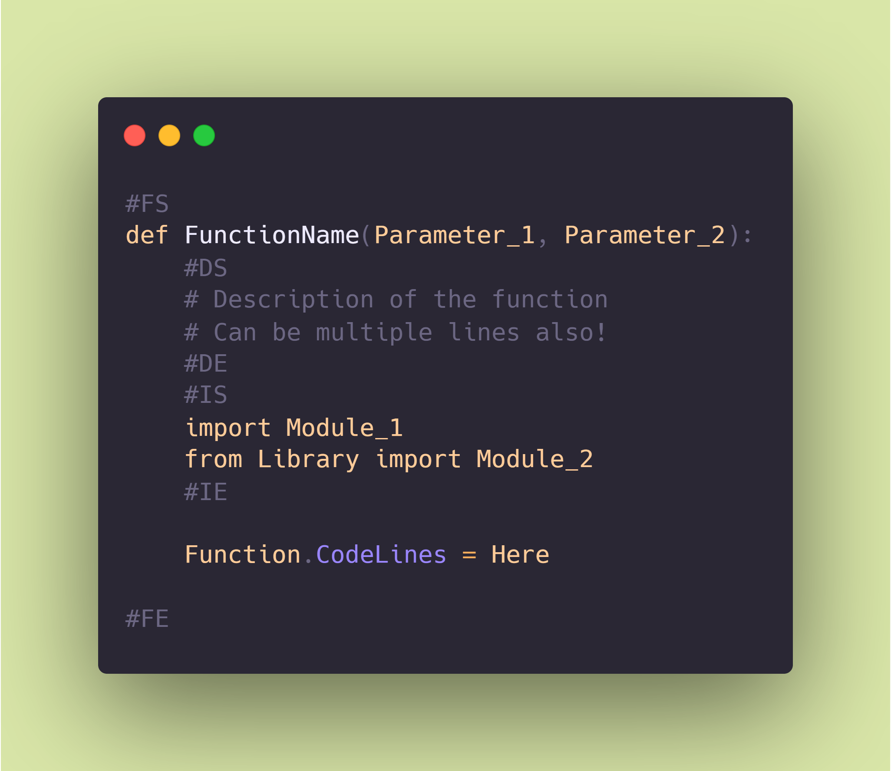
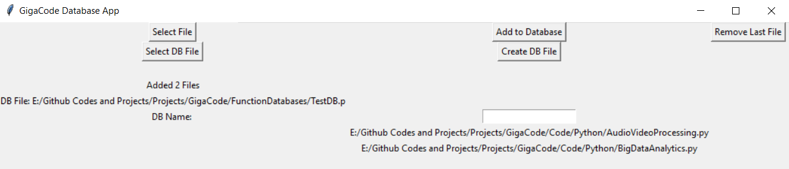
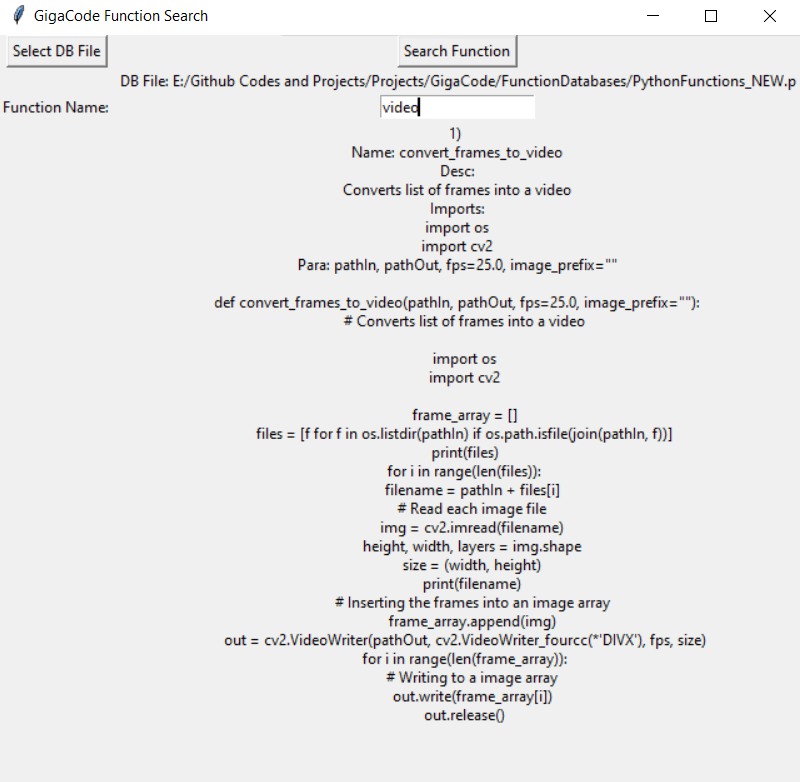

# GigaCode
 GigaCode is a functions and code parsing tool for various languages.

# Parse Functions
   
   - Implemented for Python functions
   
     Parses code written in a format specified below

     
    
     Gets the function name, parameters, description, imports and code from the parsed data.

# Function Database

   - Store parsed function data in pickle files as database of functions for later use

   - Run app_Database.py for storing new functions in a database pickle file

   

# Search Functions

   - Search for functions by input query from database pickle files

   - Run app.py for searching functions

   